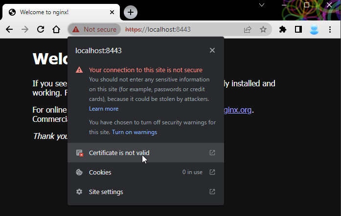
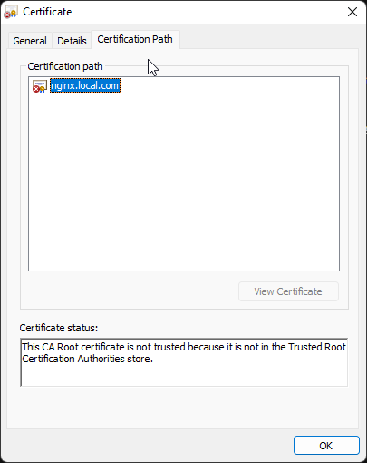
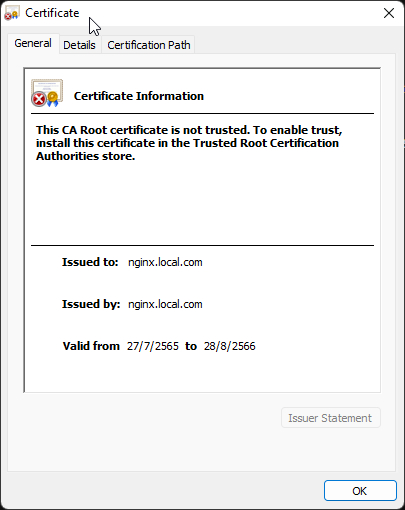
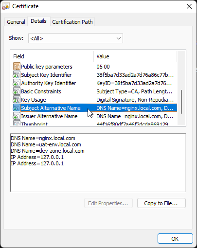

# How to create a self-signed SSL Certificate with SubjectAltName(SAN) for your sites
This topic tells you how to generate a self-signed SSL certificate request using the OpenSSL toolkit to enable HTTPS connections.

https://devopscube.com/create-self-signed-certificates-openssl/

## Prerequisite:
-   Installing OpenSSL in a workspace that you can use to generate server keys, certificates, and CSR.
-   Certificate Attributes:
    -   Subject:
        ```
        CN: CommonName
        OU: OrganizationalUnit
        O: Organization
        L: Locality
        S: StateOrProvinceName
        C: CountryName
        ```
    -   Subject Alternative Name(SAN): ()
        SAN Certificates allow you to secure a primary domain and then add additional domains to the Subject Alternative Name field of the certificate. For example, you can secure all these domains with a single SAN Certificate.

        ```bash
        DNS Name=www.google.com
        DNS Name=docs.oracle.com
        DNS Name=*.local.com      # Wildcard domain suppport subdomin such as 'dev-zone.local.com', 'uat-env.local.com'
        ```
        > Wildcard SSL to secure your entire site and all subdomains. <br>
        > Supports subdomains such as 'dev-zone.local.com', 'uat-env.local.com' <br>
        <span style="color:red">Wildcard SSL Certificate does not support mulitle asterisk (*)</span>

    -   SSL Key Length:
        The key size varies depending on whether you’re looking at symmetric vs asymmetric encryption.

        As per the current technological standard, the 2048-bit SSL RSA key length is considered secure. A 1024-bit key is outdated, and a 4096-bit SSL key is the latest one and isn’t yet supported by most browsers.

    -   Expire date (Validity):
        TLS/SSL certificates cannot be issued for more than 13 months (397 days), as announced by popular browsers, like Google and Apple at CA/Browser Forum in March 2020. This has reduced the certificate validity period from three or two to just over a year.


## Get Started:

### Step 1.
Create a new OpenSSL configuration file server.csr.cnf so you can import these settings when creating a certificate instead of entering them on the command line.
> Run the below command on Linux system. The 'cat' (short for 'concatenate') command is one of the most frequently used commands in Linux/Unix-like operating systems.
```bash
$ cat << EOF > server.csr.cnf
[req]
default_bits = 2048
prompt = no
default_md = sha256
req_extensions = req_ext
distinguished_name = dn

[dn] # Comment: Configure Your System
C=TH
ST=Bangkok
O=Nutsu
OU=Digital Platform
CN=nginx.local.com

[ req_ext ]
subjectAltName = @alt_names

[ alt_names ] # Comment: Configure Your System
DNS.1 = nginx.local.com
DNS.2 = uat-env.local.com
DNS.3 = dev-zone.local.com
IP.1 = 127.0.0.1
IP.2 = 127.0.0.1

EOF
```
> <span style="color:red">Remark !</span> The [dn] and [ alt_names ] values must be modified based on your system.
Output File:
server.csr.cnf

### Step 2.
Generate Certificate Signing Request (CSR)
```
openssl req -new -sha256 -nodes -out server.csr -newkey rsa:2048 -keyout server.key -config <( cat server.csr.cnf ) -days 397
```
Now, your .key .csr file will be created.
Output File:
*   server.key This is private key.
*   server.csr This is Certificate Signing Request (CSR) file is something you generate and give to a Certificate Authority.

Verify the attributes of your certificate request file using the command below:
```
openssl req -in server.csr -noout -text
```

Output:
```
Certificate Request:
    Data:
        Version: 1 (0x0)
        Subject: C = TH, ST = Bangkok, O = Nutsu, OU = Digital Platform, CN = nginx.local.com
        Subject Public Key Info:
            Public Key Algorithm: rsaEncryption
                RSA Public-Key: (2048 bit)
                Modulus:
                    00:c4:ab:63:f6:dc:51:14:19:1e:12:a7:f6:30:8e:
                    ef:ae:bc:18:ba:ef:60:0c:2e:42:f1:b2:cb:1b:a1:
                    2f:18:c6:0b:f2:77:cc:9a:c0:34:94:b6:85:5e:c1:
                    05:2f:c1:3b:0e:3d:f9:e0:a2:f1:be:72:e2:5e:d8:
                    dd:86:ab:9a:9b:0d:4f:92:a8:88:01:82:77:27:a3:
                    f5:2f:2f:57:5e:94:17:1a:6a:57:ed:8e:7b:f0:5c:
                    89:05:8e:fb:f2:d3:ee:e1:e6:99:f6:e3:10:bb:cb:
                    9c:50:c7:34:a4:18:43:d3:4d:c8:59:9f:f8:fc:78:
                    7b:a4:b5:70:c0:f5:ce:30:3e:34:47:f2:d6:31:93:
                    7e:1d:ca:37:0f:2c:1b:63:f5:d9:90:d7:e5:f2:18:
                    5d:d8:14:54:61:fc:13:37:de:78:95:d7:99:71:6f:
                    40:1d:a8:f2:82:f9:f3:c1:52:21:14:4a:89:1e:46:
                    a4:ab:05:07:d3:21:c5:de:ab:b6:b7:60:ef:86:80:
                    62:f1:7e:fc:ae:fd:a2:44:0d:13:f6:6d:17:24:00:
                    8c:bc:f9:f0:4e:a7:d8:1a:5a:72:e5:2a:79:98:27:
                    53:b5:03:ea:f9:fc:7a:b2:98:9c:79:8f:0e:97:a2:
                    4b:4e:3a:b4:56:7c:64:c8:d7:8f:f2:62:fc:c2:f4:
                    84:25
                Exponent: 65537 (0x10001)
        Attributes:
        Requested Extensions:
            X509v3 Subject Alternative Name:
                DNS:nginx.local.com, DNS:uat-env.local.com, DNS:dev-zone.local.com, IP Address:127.0.0.1, IP Address:127.0.0.1
    Signature Algorithm: sha256WithRSAEncryption
         91:58:21:a3:20:b7:8e:b4:ef:58:7c:23:5b:be:f7:1e:eb:1a:
         12:cc:40:96:fe:6a:5d:61:e3:3b:49:82:b8:43:25:d2:17:61:
         b5:cc:88:8f:b7:a0:40:65:89:96:12:e1:76:97:2d:b4:bc:88:
         a4:dd:3c:78:0a:a6:41:c2:5e:fa:3d:c8:d5:e3:16:d9:ea:c2:
         78:19:8f:b7:18:71:07:8e:49:ac:fe:33:46:31:6d:fe:c5:f3:
         a4:32:a0:bb:92:3a:34:9d:fe:a7:8d:10:94:57:9f:d6:5b:51:
         b5:54:8e:09:cc:5d:72:99:ae:01:53:04:33:3f:83:ec:75:df:
         95:63:64:d4:1f:95:c0:4f:d5:e3:d0:ae:69:ef:20:f4:49:e9:
         bd:52:14:30:04:2b:82:2b:46:84:b6:6b:ef:f7:30:35:f4:2a:
         98:c3:8f:9f:95:50:2a:ff:7f:f7:84:63:3b:ec:59:98:6c:86:
         48:7a:a7:0f:2c:5e:5c:b5:02:7e:e0:bf:62:5f:1d:b2:24:e1:
         ce:ed:85:b8:98:0d:35:ff:00:dc:22:ea:bd:71:f3:13:0d:41:
         74:f0:bd:d3:6f:6a:7b:a3:c6:05:ef:2c:19:a2:db:33:36:a4:
         83:43:b5:5b:49:a0:0e:a4:1d:5f:59:6c:80:6c:2c:8f:3c:b5:
         20:e0:9e:04
```     


> After this step We have a CSR certificate (.csr) file that we need to sign with a Certificate Authority (CA).
Use case 1 : 
    Send this CSR file to the customer or administrator. They will then process the signed certificate and send it back to you.
    When you receive a signed certificate cont......
    


### Step 3. (For local development)
Generate SSL certificate(.crt) With self signed

> Most browsers, such as Chrome It's requires SSL Certificates to list the site name(s) in the subject alternative name (SAN) to be trusted.

We need to create a v3.ext file in order to create a X509 v3 certificate. Notice how we’re specifying subjectAltName here.
```bash
$ cat << EOF > v3.ext
subjectKeyIdentifier   = hash
authorityKeyIdentifier = keyid:always,issuer:always
basicConstraints       = CA:TRUE
keyUsage               = digitalSignature, nonRepudiation, keyEncipherment, dataEncipherment, keyAgreement, keyCertSign
subjectAltName         = @alt_names
issuerAltName          = issuer:copy

[alt_names] # Comment: Configure Your System
DNS.1 = nginx.local.com
DNS.2 = uat-env.local.com
DNS.3 = dev-zone.local.com
IP.1 = 127.0.0.1
IP.2 = 127.0.0.1
EOF
```
Now, v3.ext file will be generated. We need it in the next step.


Generate SSL certificate(.crt) With self signed
```
openssl x509 -req -in server.csr -signkey server.key -out server.crt -days 397 -sha256 -extfile v3.ext
```
Output File:
*   server.crt 

Now, your SSL certificate (.crt) file will be generated. In windows you can double click to open it. In Linux you can use the following command:
```
openssl x509 -in server.crt -text
```

Output:
```
$ openssl x509 -in server.crt  -text
Certificate:
    Data:
        Version: 3 (0x2)
        Serial Number:
            5e:e2:65:3b:3b:3b:ec:04:db:17:bb:bd:6c:a5:5a:9f:e1:e5:48:d2
        Signature Algorithm: sha256WithRSAEncryption
        Issuer: C = TH, ST = Bangkok, O = Nutsu, OU = Digital Platform, CN = nginx.local.com
        Validity
            Not Before: Jul 27 07:09:45 2022 GMT
            Not After : Aug 28 07:09:45 2023 GMT
        Subject: C = TH, ST = Bangkok, O = Nutsu, OU = Digital Platform, CN = nginx.local.com
        Subject Public Key Info:
            Public Key Algorithm: rsaEncryption
                RSA Public-Key: (2048 bit)
                Modulus:
                    00:f7:a8:a7:1a:c3:ad:8c:52:86:c2:a6:94:d9:7b:
                    66:9e:72:67:9a:23:c8:e2:ec:e9:47:99:2d:53:bd:
                    41:7c:45:99:e0:e9:6e:cf:b7:7a:bd:58:b1:ba:8d:
                    59:50:78:e5:06:70:72:be:91:0a:a4:0b:2c:50:80:
                    ff:1e:41:67:c9:de:07:24:6c:03:7e:d3:d5:ae:33:
                    ca:f6:e9:55:09:3b:40:63:32:6a:31:00:71:16:c9:
                    21:c5:b7:2d:12:06:4b:9a:52:d6:09:80:43:7a:e6:
                    98:92:33:03:1f:e3:40:0d:a3:7a:98:bd:f2:f6:69:
                    c7:2a:fe:23:f8:81:a6:08:54:d1:49:85:0d:38:e5:
                    2d:0d:df:c5:62:00:58:de:2c:68:35:62:d8:76:87:
                    09:e4:17:ba:75:da:b9:2c:da:6f:ee:a0:70:51:82:
                    b0:15:a2:de:dc:5a:f8:c1:0c:25:4e:eb:37:95:89:
                    03:4e:54:5e:81:36:e5:ad:c1:fd:f1:04:09:46:da:
                    a6:c3:b9:cf:01:f7:23:5e:76:63:28:fc:08:05:47:
                    fb:46:b3:f1:3e:90:9e:fa:cb:3e:94:e0:40:f2:da:
                    5b:8f:4e:ce:7c:3f:53:11:90:26:0a:03:0b:09:17:
                    77:38:ee:d3:cb:99:2d:46:bd:38:d5:28:5d:7e:b6:
                    ac:6d
                Exponent: 65537 (0x10001)
        X509v3 extensions:
            X509v3 Subject Key Identifier:
                38:F5:BA:7D:33:AD:2A:7D:76:A8:6C:77:B1:86:31:53:E9:5C:41:04
            X509v3 Authority Key Identifier:
                keyid:38:F5:BA:7D:33:AD:2A:7D:76:A8:6C:77:B1:86:31:53:E9:5C:41:04
                DirName:/C=TH/ST=Bangkok/O=Nutsu/OU=Digital Platform/CN=nginx.local.com
                serial:5E:E2:65:3B:3B:3B:EC:04:DB:17:BB:BD:6C:A5:5A:9F:E1:E5:48:D2

            X509v3 Basic Constraints:
                CA:TRUE
            X509v3 Key Usage:
                Digital Signature, Non Repudiation, Key Encipherment, Data Encipherment, Key Agreement, Certificate Sign
            X509v3 Subject Alternative Name:
                DNS:nginx.local.com, DNS:uat-env.local.com, DNS:dev-zone.local.com, IP Address:127.0.0.1, IP Address:127.0.0.1
            X509v3 Issuer Alternative Name:
                DNS:nginx.local.com, DNS:uat-env.local.com, DNS:dev-zone.local.com, IP Address:127.0.0.1, IP Address:127.0.0.1
    Signature Algorithm: sha256WithRSAEncryption
         61:14:03:51:e1:b3:21:9a:53:cf:60:c0:14:53:6a:6a:c6:7f:
         8c:99:2c:46:4e:3e:e1:38:30:d5:d1:a8:0f:e0:56:6a:e4:72:
         ca:ba:17:dc:64:07:b5:1c:b3:ce:42:f8:f2:c5:00:49:d4:3d:
         8e:d8:88:8c:ad:30:cb:e6:c4:22:f9:ab:b7:09:05:a6:79:b9:
         68:4b:3b:d6:b4:89:11:bb:00:d8:0c:62:53:b4:a9:84:b3:f7:
         29:56:59:da:96:fa:eb:85:b0:3e:c5:e7:21:32:9f:b5:57:03:
         33:49:35:f1:ab:c0:4d:17:c5:94:c4:e5:26:87:85:a5:06:59:
         77:92:47:d9:11:2a:45:64:9d:5f:47:6e:6f:6f:b6:16:d4:f3:
         bf:59:58:99:bd:8f:89:d4:cc:91:74:84:1a:11:0e:3e:9d:f1:
         83:ac:1d:03:d8:a7:f3:2b:a6:70:4b:29:13:31:3e:10:b9:ae:
         bc:ba:e0:56:f8:cd:b4:e7:6a:a8:2d:93:8d:4e:2c:c8:d3:b3:
         1e:e0:24:c4:f4:4c:cf:10:99:1a:16:10:ce:db:46:30:23:65:
         d3:5b:e1:64:2f:f4:5a:41:43:1e:47:a7:fc:7c:11:91:bb:a9:
         c1:27:64:a2:44:cb:b2:83:31:55:6a:b8:3a:a7:1c:80:39:d4:
         be:cf:1c:01
-----BEGIN CERTIFICATE-----
MIIE2DCCA8CgAwIBAgIUXuJlOzs77ATbF7u9bKVan+HlSNIwDQYJKoZIhvcNAQEL
BQAwZDELMAkGA1UEBhMCVEgxEDAOBgNVBAgMB0Jhbmdrb2sxDjAMBgNVBAoMBU51
dHN1MRkwFwYDVQQLDBBEaWdpdGFsIFBsYXRmb3JtMRgwFgYDVQQDDA9uZ2lueC5s
b2NhbC5jb20wHhcNMjIwNzI3MDcwOTQ1WhcNMjMwODI4MDcwOTQ1WjBkMQswCQYD
VQQGEwJUSDEQMA4GA1UECAwHQmFuZ2tvazEOMAwGA1UECgwFTnV0c3UxGTAXBgNV
BAsMEERpZ2l0YWwgUGxhdGZvcm0xGDAWBgNVBAMMD25naW54LmxvY2FsLmNvbTCC
ASIwDQYJKoZIhvcNAQEBBQADggEPADCCAQoCggEBAPeopxrDrYxShsKmlNl7Zp5y
Z5ojyOLs6UeZLVO9QXxFmeDpbs+3er1YsbqNWVB45QZwcr6RCqQLLFCA/x5BZ8ne
ByRsA37T1a4zyvbpVQk7QGMyajEAcRbJIcW3LRIGS5pS1gmAQ3rmmJIzAx/jQA2j
epi98vZpxyr+I/iBpghU0UmFDTjlLQ3fxWIAWN4saDVi2HaHCeQXunXauSzab+6g
cFGCsBWi3txa+MEMJU7rN5WJA05UXoE25a3B/fEECUbapsO5zwH3I152Yyj8CAVH
+0az8T6QnvrLPpTgQPLaW49Oznw/UxGQJgoDCwkXdzju08uZLUa9ONUoXX62rG0C
AwEAAaOCAYAwggF8MB0GA1UdDgQWBBQ49bp9M60qfXaobHexhjFT6VxBBDCBoQYD
VR0jBIGZMIGWgBQ49bp9M60qfXaobHexhjFT6VxBBKFopGYwZDELMAkGA1UEBhMC
VEgxEDAOBgNVBAgMB0Jhbmdrb2sxDjAMBgNVBAoMBU51dHN1MRkwFwYDVQQLDBBE
aWdpdGFsIFBsYXRmb3JtMRgwFgYDVQQDDA9uZ2lueC5sb2NhbC5jb22CFF7iZTs7
O+wE2xe7vWylWp/h5UjSMAwGA1UdEwQFMAMBAf8wCwYDVR0PBAQDAgL8ME0GA1Ud
EQRGMESCD25naW54LmxvY2FsLmNvbYIRdWF0LWVudi5sb2NhbC5jb22CEmRldi16
b25lLmxvY2FsLmNvbYcEfwAAAYcEfwAAATBNBgNVHRIERjBEgg9uZ2lueC5sb2Nh
bC5jb22CEXVhdC1lbnYubG9jYWwuY29tghJkZXYtem9uZS5sb2NhbC5jb22HBH8A
AAGHBH8AAAEwDQYJKoZIhvcNAQELBQADggEBAGEUA1HhsyGaU89gwBRTamrGf4yZ
LEZOPuE4MNXRqA/gVmrkcsq6F9xkB7Ucs85C+PLFAEnUPY7YiIytMMvmxCL5q7cJ
BaZ5uWhLO9a0iRG7ANgMYlO0qYSz9ylWWdqW+uuFsD7F5yEyn7VXAzNJNfGrwE0X
xZTE5SaHhaUGWXeSR9kRKkVknV9Hbm9vthbU879ZWJm9j4nUzJF0hBoRDj6d8YOs
HQPYp/MrpnBLKRMxPhC5rry64Fb4zbTnaqgtk41OLMjTsx7gJMT0TM8QmRoWEM7b
RjAjZdNb4WQv9FpBQx5Hp/x8EZG7qcEnZKJEy7KDMVVquDqnHIA51L7PHAE=
-----END CERTIFICATE-----
```


After we've validated and issued your SSL certificate, you can install it on the Nginx server where the CSR was generated and configure the server to use it.


### Step 4. Nginx: Installing & Configuring Your SSL Certificate

Move server.crt and server.key into nginx

For example, the following config shows the Nginx config using the server certificate and private key used for SSL configuration.
```bash
server {

    listen   443;
    ssl_certificate        /etc/ssl/server.crt; #Server SSL certificate
    ssl_certificate_key    /etc/ssl/server.key; #Server private key

    listen        443 ssl;
    listen       [::]:443 ssl;
    server_name nginx.local.com uat-env.local.com; #Your domain name

    ssl_certificate     /etc/nginx/ssl/server.crt;
    ssl_certificate_key /etc/nginx/ssl/server.key;

    access_log /var/log/nginx/nginx.vhost.access.log;
    error_log /var/log/nginx/nginx.vhost.error.log;
    
    location / {
        root /usr/share/nginx/html;
        index  index.html;
    }

}
```

In my lab we using docker to run nginx server the following command:
```bash
docker run -d --rm --name nginx -p 8080:80 -p 8443:443  \
-v $(pwd)/nginx/default.conf:/etc/nginx/conf.d/default.conf:ro \
-v $(pwd)/nginx/certs/:/etc/nginx/ssl/:ro \
nginx:stable-alpine
```

### Step 5. Sanity check 
Trying to access using curl command:
```bash
openssl s_client -connect localhost:8443 -servername nginx.local.com
```
Output:
```javascript
openssl s_client -connect localhost:8443 -servername nginx.local.com
CONNECTED(00000003)
depth=0 C = TH, ST = Bangkok, O = Nutsu, OU = Digital Platform, CN = nginx.local.com
verify error:num=18:self signed certificate
verify return:1
depth=0 C = TH, ST = Bangkok, O = Nutsu, OU = Digital Platform, CN = nginx.local.com
verify return:1
..
..
..
---
```
> <span style="color:red">error:num=18:self signed certificate </span>

An error occurred while processing your request because you use self signed certificate.
There is a way to avoid this error.

Get a CA certificate that can verify the remote server and use the proper option to point out this CA cert for verification when connecting. With the openssl command line tool: --CAfile [file]
```
openssl s_client -connect localhost:8443 -servername nginx.local.com -CAfile server.crt
```

Output:
```javascript
$ openssl s_client -connect localhost:8443 -servername nginx.local.com -CAfile server.crt
CONNECTED(00000003)
depth=0 C = TH, ST = Bangkok, O = Nutsu, OU = Digital Platform, CN = nginx.local.com
verify return:1
---
Certificate chain
 0 s:C = TH, ST = Bangkok, O = Nutsu, OU = Digital Platform, CN = nginx.local.com
   i:C = TH, ST = Bangkok, O = Nutsu, OU = Digital Platform, CN = nginx.local.com
---
..
..
```











Congratulations, You have successfully set up an SSL certificate with SubjectAltName(SAN).

Don't worry about your browser showing untrusted icons. The connection between the browser or client and server remains encrypted with SSL certificate.
But we understand you. It doesn't look cool, see the next chapter.