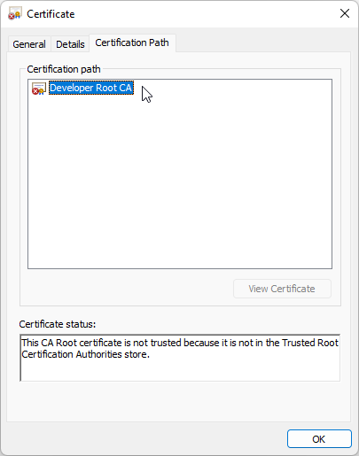
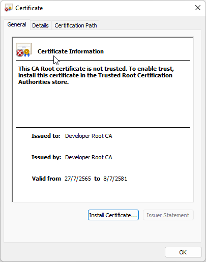
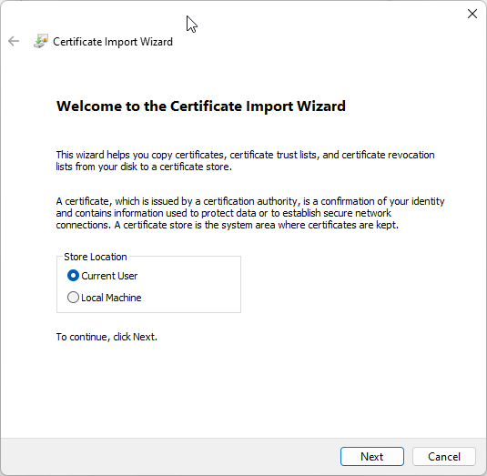
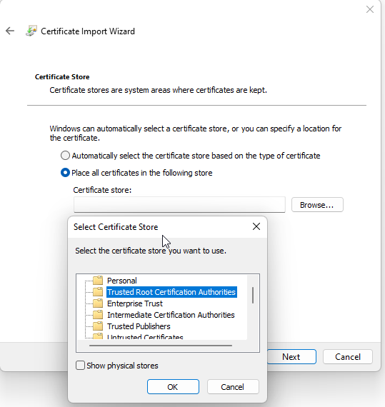
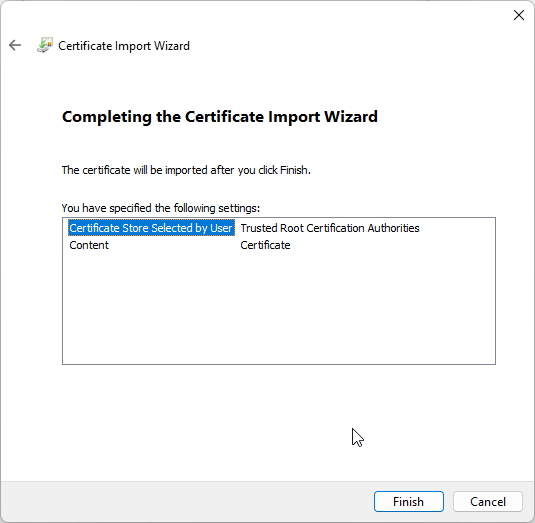
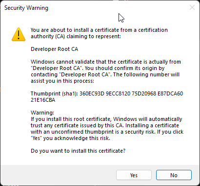
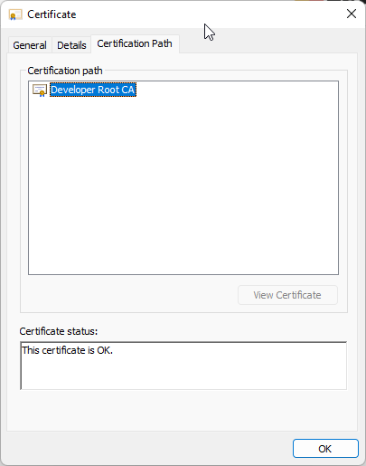

# Create CA Root certificate
We need to create our own root CA certificate for browsers to trust the self-signed certificate. So let’s create the root CA certificate first.

Let’s create a directory named openssl to save all the generated keys & certificates.

```bash
mkdir -p ./certificate/root-CA

PATH_PRIVATE_KEY="./certificate/DevRootCA.key"   # Set output private key name.

# Command generate private key
openssl genrsa -des3 -out ${PATH_PRIVATE_KEY} 2048
```
You will be prompted for a passphrase, which I recommend not skipping and keeping safe. The pass phrase will prevent anyone who gets your private key from generating a root certificate of their own. Output should look like this:

<em>Output (Do not copy)</em>
```javascript
Generating RSA private key, 2048 bit long modulus (2 primes)
..................................................................................................+++++
.............+++++
e is 65537 (0x010001)
Enter pass phrase for DevRootCA.key:
Verifying - Enter pass phrase for DevRootCA.key:
```

Now, your .key file will be created.

<br>

Then we generate a root certificate:

> .pem file is a container format that may just include the public certificate 

```bash
PATH_PRIVATE_KEY="./certificate/DevRootCA.key"   # Set private key file location. 
PATH_PEM="./certificate/DevRootCA.pem"           # Set pem file output location. 

openssl req -x509 -new -nodes -key ${PATH_PRIVATE_KEY} -sha256 -days 5825 -out ${PATH_PEM}
```

<em>Output (Do not copy)</em>
```javascript
$ openssl req -x509 -new -nodes -key ${PATH_PRIVATE_KEY} -sha256 -days 5825 -out ${PATH_PEM}
Enter pass phrase for ./certificate/DevRootCA.key:
You are about to be asked to enter information that will be incorporated
into your certificate request.
What you are about to enter is what is called a Distinguished Name or a DN.
There are quite a few fields but you can leave some blank
For some fields there will be a default value,
If you enter '.', the field will be left blank.
-----
//Replace with your parameter
Country Name (2 letter code) [AU]:TH
State or Province Name (full name) [Some-State]:Bangkok
Locality Name (eg, city) []:
Organization Name (eg, company) [Internet Widgits Pty Ltd]:Nutsu
Organizational Unit Name (eg, section) []:Digital Platform
Common Name (e.g. server FQDN or YOUR name) []:Developer Root CA
Email Address []:
```

**Now, We have two files:**
*   DevRootCA.key is Private Key of Root CA
*   DevRootCA.pem is certificate in Base64 encoded DER certificate format. 

Sometimes you need .crt format, So openssl provides commands for convert. the following command:
```bash
openssl x509 -outform der -in ${PATH_PEM} -out ./certificate/DevRootCA.crt
```

<br><br><br>

# To enable trust, install this certificate in the Trustd Root Certification Authorities store.

## For Windows OS

You can double click ".crt" to open file. 















## For Linux OS
```bash
sudo cp DevRootCA.crt /usr/local/share/ca-certificates/
#Update the CA store: 
sudo update-ca-certificates
```

<em>Output (Do not copy)</em>
```javascript
$ sudo update-ca-certificates
Updating certificates in /etc/ssl/certs...
rehash: warning: skipping DevRootCA.pem,it does not contain exactly one certificate or CRL
1 added, 0 removed; done.
Running hooks in /etc/ca-certificates/update.d...
done.
```

> <font color="red">**! For Remove**<br></font>
> Remove your CA file in /usr/local/share/ca-certificates/ <br>
> Update the CA store: 
```
sudo update-ca-certificates --fresh
```