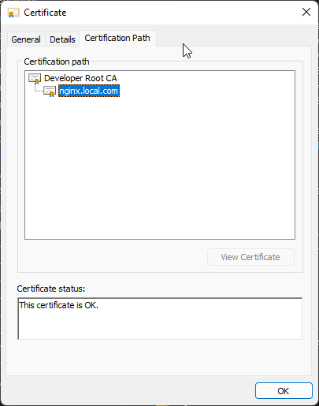
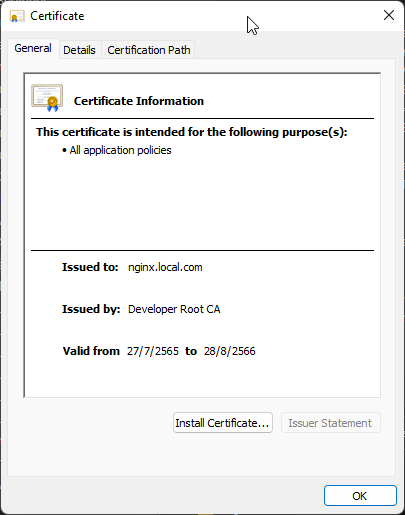
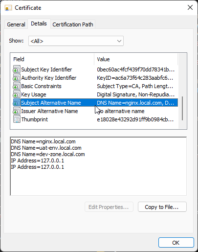

# Signed Self-signed certificate with Your Root CA

A certificate signing request is issued via the root SSL certificate we created earlier to create a domain certificate for localhost. The output is a certificate file called server.crt.


```bash
cd ./certificate
FILE_ROOT_CA_KEY="./root-CA/DevRootCA.key"
FILE_ROOT_CA_PEM="./root-CA/DevRootCA.pem"
FILE_CERTIFICATE_REQUEST="./certificate-request/server.csr"
FILE_CONFIG_EXT="./certificate-request/v3.ext"
FILE_CERTIFICATE_SIGNED="./server.signed.crt"

openssl x509 -req -in ${FILE_CERTIFICATE_REQUEST} -CA ${FILE_ROOT_CA_PEM} -CAkey ${FILE_ROOT_CA_KEY} -CAcreateserial -out ${FILE_CERTIFICATE_SIGNED} -days 397 -sha256 -extfile ${FILE_CONFIG_EXT}
```
The self-signed certificate file has been created. 
*   server.signed.crt


In Windows, you can double click to open it. You will notice that it is created under Root CA.




