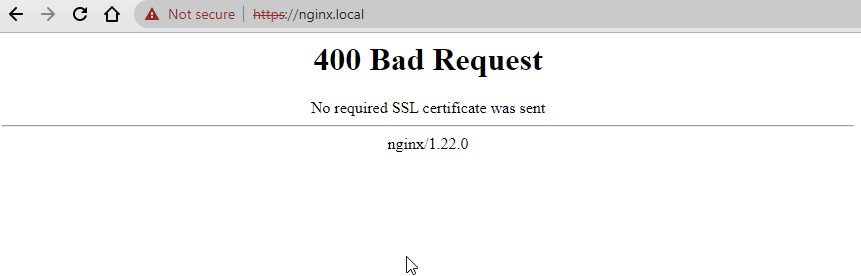
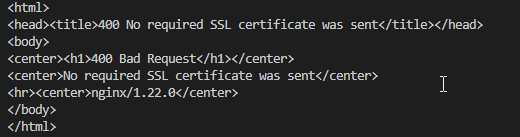
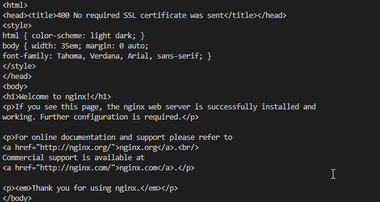
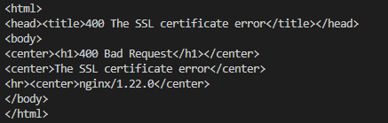

## Create the server key and certificate

mkdir -p ./var/certs/server
cd ./var/certs/server

openssl req -x509 -newkey rsa:2048 -sha256 -days 3650 -nodes \
  -keyout server.key -out server.crt -subj "/CN=nginx.local" \
  -addext "subjectAltName=DNS:*.nginx.local,DNS:nginx.local,IP:127.0.0.1"

Now, your .key .csr file will be created.
Output File:
*   server.key This is private key.
*   server.crt This is Certificate.


Extra OpenSSL Commands for Checking and Verification
You can use the following command to check a private key

```
openssl rsa -in server.key -check
openssl x509 -in server.crt -text -noout
```

### Create ssl_client_certificate file.
Create the ssl_client_certificate file. to accept clients that will request their own certificate that matches this file.
We currently have no clients. So we will create an empty file.
```
touch trust-client.crt
```

cd ../../..

### Start Nginx

docker-compose up -d
docker-compose ps
docker-compose logs

Try to access.
curl -vk --resolve nginx.local:443:127.0.0.1 https://nginx.local


## Create the client key and certificate

```shell
mkdir -p ./consumer/certs
cd ./consumer/certs

# Create a customer key and certificate for Consumer-A.
openssl req -x509 -nodes -days 365 -newkey rsa:2048 -keyout client-a.key -out client-a.crt -subj "/CN=Consumer-A"

# Create a customer key and certificate for Consumer-B.
openssl req -x509 -nodes -days 365 -newkey rsa:2048 -keyout client-b.key -out client-b.crt -subj "/CN=Consumer-B"
```

### (Optional) If you would like to convert file format
The next step is to combine both of them together as PKCS12 file so that you can import them into the client’s browser for mutual TLS authentication. It will prompt you for password. Simply click enter to create a PKCS12 file without a password.
```
openssl pkcs12 -export -out client.pfx -inkey client.key -in client.crt
```

openssl pkcs12 -info -in client.pfx

cd ../../..

openssl pkcs12 -in client.pfx -out client.pem
openssl x509 -in certificatename.cer -outform PEM -out certificatename.pem


## Apply Mutual TLS Authentication to Nginx server.

Add the following lines to enable mutual TLS authentication with nginx
```
    #Enable mTLS
    ssl_client_certificate  /etc/nginx/ssl/trust-client.crt;
    ssl_verify_client       on; #on | off | optional | optional_no_ca;
    ssl_verify_depth        2;
```

Add the clients you accept to the file. ssl_client_certificate:

cat ./consumer/certs/client-a.crt > ./var/certs/server/trust-client.crt

Try again to access the nginx home page.



! Congratulation your server protected using Mutual TLS Authentication.
<br>
<br>
<br>

> If you have multiple client certificates, simply concatenate them into one single file as follows.

```
cat cert1.crt cert2.crt > certs.pem
```

---

## Access Nginx with client certificate.
### Try without client certificate.
```
curl https://127.0.0.1 -k
```


### Try with client certificate.
```
curl --key ./consumer/certs/client-a.key --cert ./consumer/certs/client-a.crt https://127.0.0.1 -k
```



### Try with client certificate(client-b).
```
curl --key ./consumer/certs/client-b.key --cert ./consumer/certs/client-b.crt https://127.0.0.1 -k
```

Your request has been denied. because the client-b certificate doesn't match the nginx server.



Fix this, Add the clients you accept to the file. 
```
cat ./consumer/certs/client-a.crt ./consumer/certs/client-b.crt > ./var/certs/server/trust-client.crt
```

Once you are done, the next step is to verify your configuration file via the following command to make sure that there is no error.
Using "nginx -t"
```
docker-compose exec nginx-sandbox nginx -t
```

**Important**, After you add certificate in nginx server this need to reload configuration.
```
docker-compose exec nginx-sandbox nginx -s reload
```

Try again to request with client-b certificate
```
curl --key ./consumer/certs/client-b.key --cert ./consumer/certs/client-b.crt https://127.0.0.1 -k
```

```
curl --key ./consumer/certs/client-b.key --cert ./consumer/certs/client-b.crt https://127.0.0.1/httpbin/anything -k
```
Result (do not copy)
```
{
  "args": {},
  "data": "",
  "files": {},
  "form": {},
  "headers": {
    "Accept": "*/*",
    "Host": "httpbin.org",
    "Ssl-Client": "CN=Consumer-B",
    "Ssl-Client-Issuer": "CN=Consumer-B",
    "Ssl-Client-Verify": "SUCCESS",
    "User-Agent": "curl/7.68.0",
    "X-Amzn-Trace-Id": "Root=1-64547f24-06e2bf304f347f3926f1c739"
  },
  "json": null,
  "method": "GET",
  "origin": "119.76.33.92",
  "url": "https://httpbin.org/anything"
}
```


---
Other commands that will help you get to this lab.
```
docker-compose up -d
docker-compose ps
docker-compose logs

docker-compose exec nginx-sandbox sh
docker-compose exec nginx-sandbox nginx -t
docker-compose exec nginx-sandbox nginx -s reload
```

